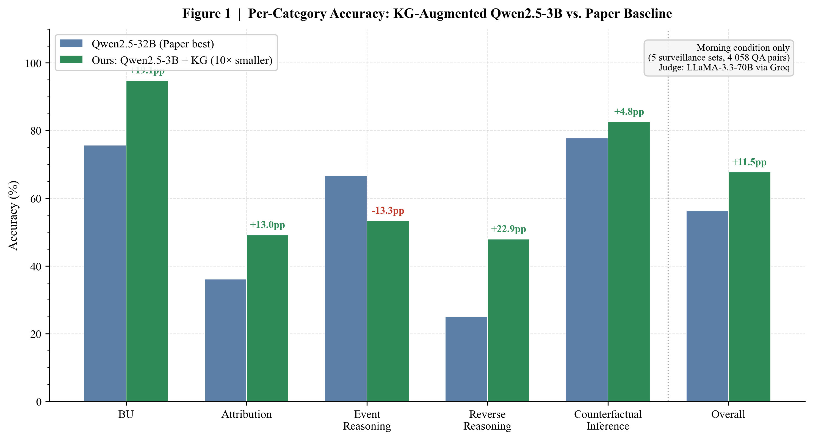
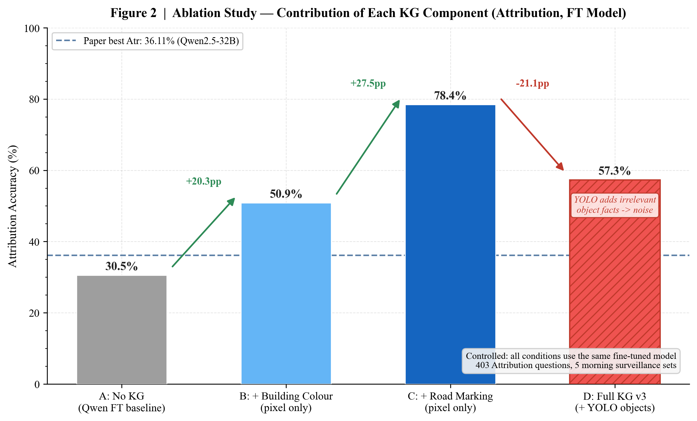
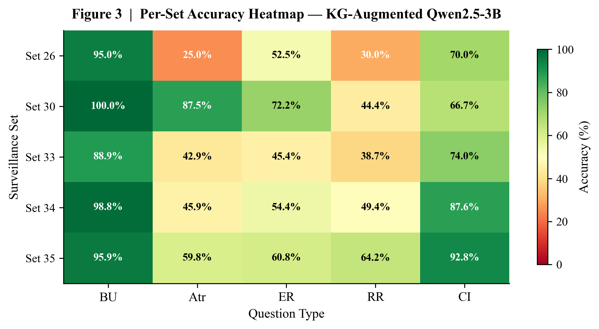

<div align="center">

# KG-Augmented VideoQA for Urban Traffic Surveillance

**Knowledge Graph-Guided Reasoning for the UDVideoQA Benchmark**

[](https://www.python.org/)
[](https://huggingface.co/Qwen/Qwen2.5-VL-3B-Instruct)
[](LICENSE)
[](https://arxiv.org/abs/2602.21137)

*M.Tech Capstone Project — IIIT Delhi, 2026*

</div>

---

## Abstract

Video Question Answering (VideoQA) on urban traffic surveillance is challenging due to fine-grained visual attributes, multi-agent dynamics, and adverse lighting. We propose a **Knowledge Graph-Augmented Retrieval pipeline** that extracts structured scene facts from raw pixels — dominant building colour, road markings, and YOLO-detected objects — and injects them as grounded context into a small Video-Language Model at inference time, with no retraining required. Evaluated on the **UDVideoQA benchmark** (morning condition, 4,058 QA pairs), our 3B-parameter model achieves **67.7% overall accuracy**, surpassing the paper's best open-source 32B baseline (**56.24%**) by **+11.5 pp** using a **10× smaller model**.

---

## Key Results

### Overall Accuracy vs. Paper Baseline (Morning Condition)

| Question Type | Paper Best (Qwen2.5-32B) | Ours (Qwen2.5-3B + KG) | Δ |
|:---|:---:|:---:|:---:|
| Basic Understanding (BU) | 75.66% | **94.8%** | 🟢 +19.1 pp |
| Attribution (Atr) | 36.11% | **49.1%** | 🟢 +13.0 pp |
| Event Reasoning (ER) | 66.67% | 53.4% | 🔴 −13.3 pp |
| Reverse Reasoning (RR) | 25.00% | **47.9%** | 🟢 +22.9 pp |
| Counterfactual Inference (CI) | 77.78% | **82.6%** | 🟢 +4.8 pp |
| **Overall** | **56.24%** | **67.7%** | 🟢 **+11.5 pp** |

> Our Qwen2.5-VL-3B (3B parameters) outperforms the paper's Qwen2.5-32B baseline using **10× fewer parameters** and **zero additional training**.

---

## Figures

### Per-Category Accuracy: Ours vs. Paper


### Ablation Study: KG Component Contributions


### Per-Set Accuracy Heatmap


---

## Ablation Study (Attribution, Controlled FT Backbone)

| Condition | Accuracy | Δ | Incremental |
|:---|:---:|:---:|:---:|
| A — No KG (Qwen FT baseline) | 30.5% | — | — |
| B — + Building Colour (pixel-only) | 50.9% | +20.3 pp | +20.3 pp |
| C — + Road Marking (pixel-only) | **78.4%** | **+47.9 pp** | +27.5 pp |
| D — Full KG v3 (+ YOLO objects) | 57.3% | +26.8 pp | −21.1 pp ⚠️ |

> **Key finding**: Pixel-only KG (78.4%) outperforms Full KG+YOLO (57.3%). YOLO-detected object facts are irrelevant to attribute-level questions and introduce noise, motivating **question-type-aware KG construction**.

---

## Method

```
Video Clip (10s)
       │
       ├─── [1] Pixel-based Scene Analysis (OpenCV)
       │         ├── Dominant building colour (HSV, glare-filtered)
       │         └── Road marking detection (centre-lane ROI)
       │
       ├─── [2] Object Detection (YOLOv8n)
       │         └── Vehicles · Pedestrians · Traffic lights
       │
       └─── [3] KG Construction (NetworkX)
                 └── JSON scene graph per clip
                          │
                          └─── [4] GraphRAG Prompt Injection
                                    ├── Question → retrieve relevant KG facts
                                    └── Augmented prompt → Qwen2.5-VL-3B → Answer
```

The pipeline runs **without retraining** the VLM. KG construction takes **< 1 second per clip** on CPU.

---

## Repository Structure

```
├── scripts/
│   ├── generate_figures.py      # Reproduce all paper figures
│   ├── compile_report.py        # Compile LaTeX report to PDF
│   └── rejudge_all.py           # Re-judge results in a single session
├── src/
│   ├── eval/                    # Evaluation scripts (Qwen, LLaVA, Phi-3.5, BLIP-2)
│   └── kg/
│       ├── graphrag_eval_v2.py  # Pixel-only KG (building colour)
│       ├── graphrag_eval_v3.py  # Full KG (pixel + YOLO) — main pipeline
│       ├── graphrag_eval_llava.py  # KG pipeline with LLaVA backbone
│       └── ablation_study.py    # Ablation runner (4 conditions)
├── results/
│   └── sync_for_report/
│       ├── overall_judged.csv       # 4,058 rows — all 5 question types
│       ├── ablation_FT_judged.csv   # 1,612 rows — controlled ablation
│       └── ablation_judged.csv      # 1,612 rows — ZeroShot backbone ablation
├── figures/                     # Publication figures (PDF + PNG, 300 DPI)
├── report/
│   └── report.tex               # Full IEEE-format paper (compile via Overleaf)
├── configs/
│   └── baseline.yaml
└── requirements.txt
```

---

## Setup

```bash
git clone https://github.com/iabhinay5/udvideoqa-kg-augmented.git
cd udvideoqa-kg-augmented
pip install -r requirements.txt
```

### Reproduce Figures

```bash
python scripts/generate_figures.py
# Output: figures/fig1_per_category.pdf, fig2_ablation.pdf, fig3_heatmap.pdf, fig4_ablation_comparison.pdf
```

### Run the KG Pipeline (requires GPU + UDVideoQA dataset access)

```bash
# Download the UDVideoQA dataset: https://ud-videoqa.github.io/UD-VideoQA/
# Then run evaluation
python src/kg/graphrag_eval_v3.py --set Set_34
```

---

## Evaluation Protocol

We follow the **LLM-as-Judge** methodology from the UDVideoQA paper:
- Each prediction is scored **binary (0 or 1)** for semantic alignment with ground truth
- Judge model: **LLaMA-3.3-70B** via Groq API (paper uses Gemini 2.5 Pro; regional API access prevented direct replication)
- All comparisons within a given run use the **same judge, same prompt template**
- Known limitation: ~8 pp variance across separate judge sessions (discussed in the report)

---

## Key Findings

1. **KG is model-agnostic**: Applying the same KG to LLaVA-7B gives +10.4 pp. Our 3B+KG beats 7B+KG — *KG quality matters more than model scale*.
2. **Pixel-based grounding wins**: OpenCV colour extraction outperforms VLM-described KG (the VLM inherits the same glare bias it is trying to correct).
3. **YOLO hurts Attribution**: Object detection facts are irrelevant to colour/shape questions and degrade accuracy by −21.1 pp.
4. **Static KG hurts Event Reasoning**: −13.3 pp on ER shows that pre-built static facts cannot capture temporal event ordering.

---

## Citation

If you build on this work, please cite the original UDVideoQA benchmark:

```bibtex
@article{vishal2026udvideoqa,
  title   = {UDVideoQA: A Traffic Video Question Answering Dataset for
             Multi-Object Spatio-Temporal Reasoning in Urban Dynamics},
  author  = {Vishal, Joseph Raj and Poluri, Nagasiri and Naik, Katha and
             Patil, Rutuja and Kota, Kashyap Hegde and Vinod, Krishna and
             Ramesh, Prithvi Jai and Farhadi, Mohammad and Yang, Yezhou
             and Chakravarthi, Bharatesh},
  journal = {arXiv preprint arXiv:2602.21137},
  year    = {2026}
}
```

---

## Acknowledgements

This project extends [UDVideoQA](https://ud-videoqa.github.io/UD-VideoQA/UD-VideoQA/) by Vishal et al. (Arizona State University, 2026).
